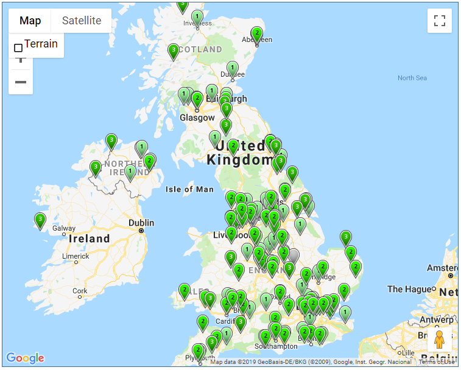
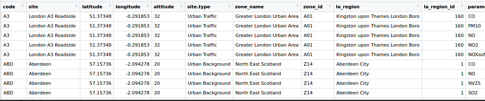
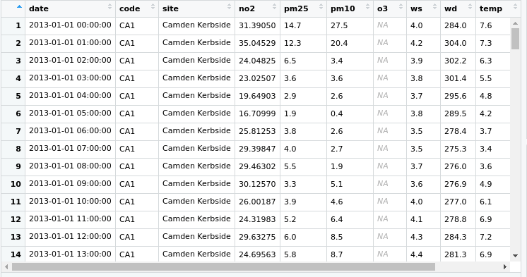
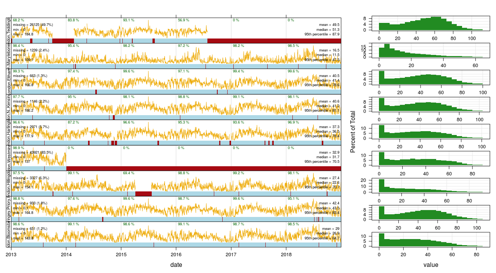
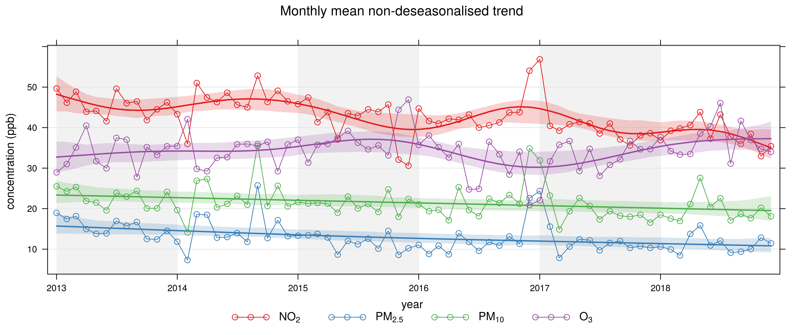
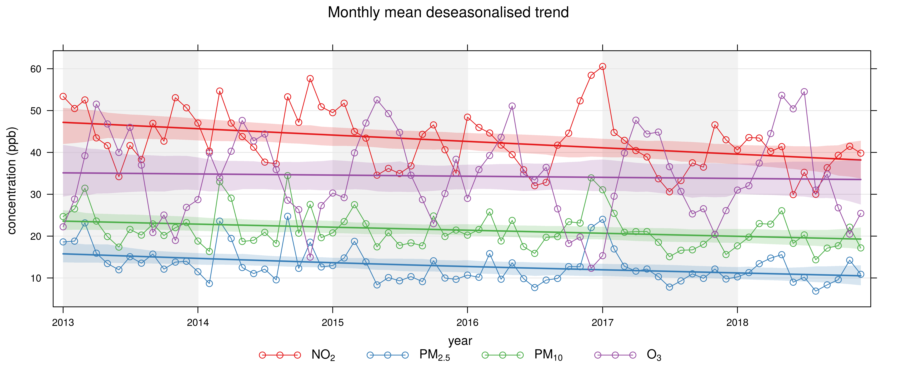

# LDN Air Analysis

London is facing a big challenge ahead in terms of tackling environmental constraints due to air quality. The air pollution have become in a critical risk towards citizens health and well being.  Despithe society tend to pint finger to vehicles and industries, people itsef generate their own carbon footprint. Thats why, frequestn air analysis per area and globally are necesary.
 
This analysis shows the air quality in greather London area. An **average** measure of each pollutanat were calculated in order to measure their impact in the air quality.  Currently, The UK has a lot AURN statiosn to detect pollutant matrials and report their concentrations, but this analysis will include all  AURN networks located in the Great London area, wich includes 39 stations that monitor 57 pollutants. 

  

Although all of them cause effect in humans, animals, structures and vegetation, some of them are considered highly harmful and due to their effects in human health.  These pollutants are the particulates **PM2.5** and **PM10**,  nitrogen dioxide **NO2** and ozone  **O3** which are regulated by the [European Environmental Agency EEA](https://www.eea.europa.eu/themes/air/air-quality-standards).

## Tools:
 - R
 - [Open Air](www.openair-project.org) (R Library for air analysis)
 - ggplot2 for R
 - MySQL database.
 
 
 ## Dataset
The datasets used for this analysis can be accessed through [UK Air web site](https://uk-air.defra.gov.uk/data), which is part of the [Department for Environment Food and Rural Affairs of U.K](https://www.gov.uk/government/organisations/department-for-environment-food-rural-affairs).
There is two datasets: **The stations** and **the measures**. The stations dataset contains metadata related to the station like location, name, time of use, time off, parameters for calibration, etc.  Despite the stations are phisycally located in different areas of London and each station measures a set of pollutants, not all the stations measures the same.

  

The pollutnats concentrations are measured per hour and stored in the station. After a considerable time, the information is extracted from the stations al=nd published in the **UK Air Website**. The interval of time used in this analysis were 6 years (2013-2018). 

  

## Pollutant selection criteria
The European Union (EU) through the European Environment Agency has developed an extensive legislation which establishes standards and objectives for a number of pollutants in air. The selection criteria for the pollutant to analyze will be that one that has exceeded this quality index limit more frequently. 

## Output
A `.csv` file that contains the average measures of the most significant pollutant in London.

## Some Plots

  

  

  

  

